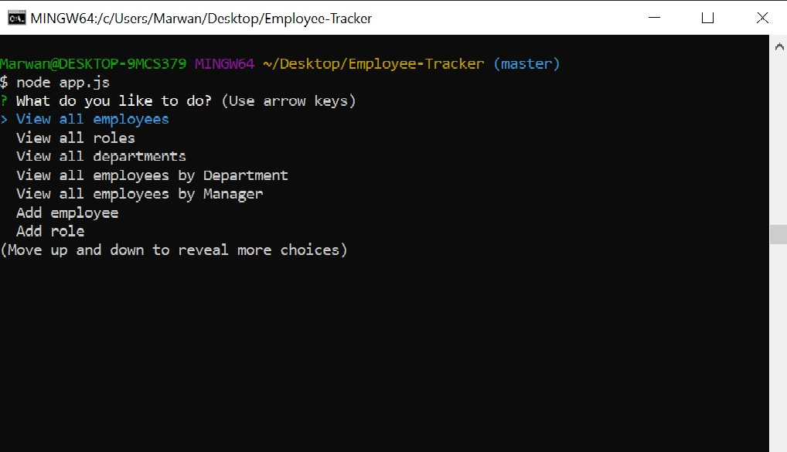
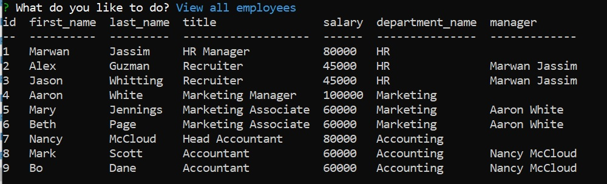

# Employee-Tracker
This App will allow you to add, remove, list and update employees from your firm.

## Preview



## Need to Install
npm, mySQL, inquirer, console.table 

## Code Snippets
```sql
SELECT e.id, e.first_name, e.last_name, roles.title, roles.salary, departments.name as department_name, CONCAT_WS(' ', m.first_name, m.last_name) as manager
FROM employees e
INNER JOIN roles ON e.role_id=roles.id
INNER JOIN departments ON roles.department_id=departments.id
LEFT JOIN employees m on e.manager_id=m.id
```
This SQL is to select an employee and get all their information from multiple tables.

```sql
SELECT DISTINCT CONCAT_WS(' ', m.first_name, m.last_name) as name, m.id as value
  FROM employees m
  INNER JOIN employees e ON m.id=e.manager_id
```
`SELECT DISTINCT` is used to make sure that managers aren't listed twice when listing managers.

```sql
CREATE TABLE roles(
    id INT NOT NULL AUTO_INCREMENT,
    title VARCHAR (30) NOT NULL,
    salary DECIMAL NOT NULL,
    department_id INT NOT NULL,
    PRIMARY KEY (id),
    CONSTRAINT fk_department_id
    FOREIGN KEY (department_id)
      REFERENCES departments(id)
      ON DELETE CASCADE
);
```
The `ON DELETE CASCADE` part makes it so that if you delete a department, it will delete any roles in it.